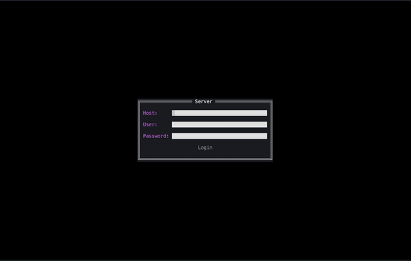

# gopasskeeper
The repository comprises the final project for Yandex Practicum "Go-developer Advanced" course. The project `gopasskeeper` is a server-client application to store secrets like login-password `accounts`, `bank cards`, `notes`, `files`. It includes GRPC-server and TUI-client written in Go. The application deppends on PostgreSQL and MinIO, it encrypts input data using Fernet and AES for database content and files respectively.

## Setup dependencies
You can use [bitnami/postgresql](https://hub.docker.com/r/bitnami/postgresql) to start PostgreSQL server and [bitnami/minio](https://hub.docker.com/r/bitnami/minio) to start MinIO server.

Or just use the `docker-compose.yaml` file to setup dependencies with docker-compose utility like this:
```bash
docker compose -f docker-compose.yaml up -d 
```

### Setup MinIO
You can use the comand below to start MinIO server.
```bash
docker run --name gopasskeeper-minio -d -e MINIO_ROOT_USER=admin -e MINIO_ROOT_PASSWORD=password -e MINIO_USE_SSL=0 -e MINIO_DEFAULT_BUCKETS=storage-dev -p 9000:9000 -p 9001:9001 bitnami/minio:latest
```

In order to start the application server you need to create a service account. To create a service account login to the MinIO web-interface (localhost:9090) and create `access key`. This `access key` should be indicated in the config file by address `s3.accessKey` and `s3.secretAccess`.

## Configuration
In order to start server, client and make proper migrations you need to place `server-config.yaml` in the root directory. The example of its content is further:
```yaml
app:
  env: local
  logLevel: debug
  outputFile: logs/stdout.log
  healthHost: 127.0.0.1
  healthPost: 8080
s3:
  host: 127.0.0.1
  port: 9000
  accessKey: pwb1OknjOtg3HxhIxwOI
  bucket: storage-dev
  secretAccess: 2HjWjtpoPaYs0jrXhvYgJlVzhN0F3WyuTI6WXRsS
postgresql:
  host: 127.0.0.1
  port: 5442
  user: postgres
  password: thepass123
  database: postgres
  maxOpenConn: 10
  maxIdleConn: 10
  duration: 5s
  migrationFolder: ./migrations
security:
  tokenTTL: 1h
  signKey: 87ccd01b-0b99-4f3a-8422-dd088f22cde0
  certPath: ./certs/cert.pem
  certKeyPath: ./certs/key
server:
  host: 127.0.0.1
  port: 9090
  timeout: 30s
```
Please study it carefully in order to setup secrets properly, be mindful setting up s3, postgresql and security sections.

## Build
You are welcome to use `Makefile` commands to build binaries, i.e.:
```bash
make go-build
```
To make builds for client, server, migration and certificate generation.

## Migrations
In order to setup PostgreSQL properly you need to make migration. So, just input proper settings for PostgreSQL in the `server-config.yaml` and use this command:
```bash
make go-migrate
```

## Launch server
If you setup all configurations properly there won't be an issue to start the GRPC-server:
```bash
make go-server
```

## Launch client
The same case is with the client, just use this command to start TUI-client:
```bash
make go-client
```

You should see something like this.


## A quick notice
The TUI-client can be used on different devices, all the changes will be synchronised among devices automatically.
